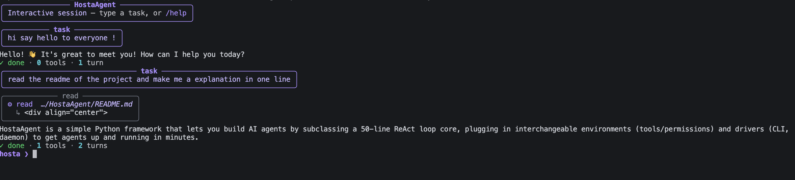

<div align="center">

# HostaAgent

**A framework to build agents the simplest way possible.**

[](https://pypi.org/project/hostaagent/)
[](https://www.python.org/)
[](LICENSE)
[](https://github.com/hand-e-fr/HostaAgent/actions/workflows/ci.yml)
[](https://github.com/astral-sh/ruff)

</div>

Its core — the ReAct loop — is about 50 lines you subclass. That's the whole
engine; everything else just plugs in around it. Fork it, add your tools, ship an
agent in minutes.

It builds on [OpenHosta](https://github.com/hand-e-fr/OpenHosta) (the typed LLM call
and tool calling) and adds the loop, two seams, and a command-line interface on top.

---

## Install

### From PyPI

```bash
pip install hostaagent          # not published yet — coming soon
```

### From the repository

```bash
git clone https://github.com/ramosleandre/HostaAgent.git
cd HostaAgent
python -m venv .venv && source .venv/bin/activate   # recommended
pip install -e ".[dev]"          # editable install + dev tools (ruff, mypy, pytest)
```

Working on OpenHosta at the same time? Install it from your local checkout so your
edits are live: `pip install -e ../OpenHosta && pip install -e . --no-deps`.

## The idea

The goal is a skeleton to develop agents fast. An agent is split into three
fully-agnostic parts — swap any one without touching the others:

| Part | What it is | Default |
|---|---|---|
| **Agent** | the brain — the invariant async ReAct loop (`core.py`, ~50 lines) | you rarely touch it |
| **Environment** | the body — what it can do and touch (`tools()` + `context()`) | `LocalFS` (read / grep / write / bash) |
| **Driver** | the lifecycle — how and when it runs | `CliDriver`, `DaemonDriver` |

Plug a new body to get a new agent type (computer-use, browser, game NPC). Plug a
new driver to get a new way to run (CLI, daemon, webhook). The loop stays the same.

## Two ways to use it

### As a Python package

Subclass `Agent`, give it a body, run it through a driver. Configuration is
subclassing — no TOML, JSON, or DSL for the agent itself.

```python
from hostaagent import Agent, LocalFS, tool

@tool
def run_tests(suite: str = "all") -> str:
    "Run pytest on the project."
    import subprocess
    return subprocess.run(["pytest", suite], capture_output=True, text=True).stdout[:3000]

class CodeAgent(Agent):
    persona = "You are a coding agent. Read before editing. Run tests after changes."
    def register_tools(self):
        self.use(run_tests)

if __name__ == "__main__":
    from hostaagent.driver.cli import launch
    launch(CodeAgent(env=LocalFS(".")))   # opens the violet CLI, using your `hosta config` model
```

For headless / programmatic use (no UI), run it through a driver instead:
`CliDriver(lambda: CodeAgent(env=LocalFS("."))).run()`.

Ready-to-run agents in [`examples/agents/`](examples/agents/):

| Agent | What it does |
|---|---|
| [`code.py`](examples/agents/code.py) | reads, edits, and runs the test suite |
| [`sql.py`](examples/agents/sql.py) | schema-aware, read-only SQL analyst over a SQLite database |
| [`git.py`](examples/agents/git.py) | reviews your local `git diff` and suggests fixes |
| [`research.py`](examples/agents/research.py) | fetches URLs and synthesizes a cited answer (stdlib only) |

Plus [`custom_env.py`](examples/custom_env.py) (a custom `Environment`) and
[`daemon_webhook.py`](examples/daemon_webhook.py) (a `DaemonDriver`).

**Register an agent once, then run it by name:**

```bash
hosta add agent examples/agents/sql.py     # registers it as "sql"
hosta agents                               # list registered agents
hosta --agent sql "top 5 customers by spend"
hosta use sql                              # make it the default → plain `hosta` runs it
```

Or run a file directly — `hosta --agent examples/agents/sql.py "…"` or
`python examples/agents/sql.py "…"`.

### As the `hosta` command

The default configuration is a simple code agent that lives in your working
directory and runs as a CLI. Just launch it — on first run it walks you through a
quick setup (choose a provider: OpenAI, Gemini, a local Ollama/vLLM server, …):

```bash
hosta                          # first run: setup, then an interactive session
hosta "summarize README.md"    # one-shot task
hosta --agent sql "…"          # run a registered agent (or a file path)
hosta --model gpt-4o "…"       # override the model
hosta add agent ./my_agent.py  # register an agent (names it after the file)
hosta agents                   # list registered agents
hosta use sql                  # set the default agent for plain `hosta`
hosta config                   # setup wizard  (· config show  · config set <k> <v>)
```

Provider support today (anything OpenAI-compatible): **OpenAI**, **Gemini** (its
OpenAI-compatible endpoint), and **local** servers (Ollama, vLLM, LM Studio).
Native **Anthropic** is on the roadmap. The model must support tool calling.

Configuration is cached in `~/.hostaagent/config.toml` (a project can override it
with `./.hostaagent.toml`) — the only config file in the project.

## Inside a `hosta` run

A run renders as step cards: condensed tools (no long absolute paths), the agent's
reasoning, then the answer, then a status line.



In a session, type `/` to autocomplete commands:

| Command | Effect |
|---|---|
| `/model <name>` | switch model for the session |
| `/tools` | list available tools |
| `/think` | toggle showing the agent's reasoning |
| `/clear` | clear the screen |
| `/help`, `/exit` | help, quit (or `Ctrl-D`) |

## Project layout

```
hostaagent/
├── core.py            # Agent — the ~50-line ReAct loop  (the brain)
├── types.py           # AgentResult, Turn, ToolUse
├── config.py          # ~/.hostaagent/config.toml load/save + model resolution
├── environment/       # the body seam — detachable environments
│   ├── base.py        #   Environment
│   └── local.py       #   LocalFS
└── driver/            # the lifecycle seam — detachable drivers
    ├── base.py        #   Driver, CliDriver, DaemonDriver
    └── cli/           #   the hosta app (theme, render, repl, wizard)
```

## Contributing

- CI (ruff + mypy + pytest, Python 3.10–3.12) runs on every PR.
- Never push to `main`. Open a PR from a feature branch.
- Run `ruff check . && mypy hostaagent && pytest -q` before opening a PR.

## License

MIT — see [LICENSE](LICENSE).
